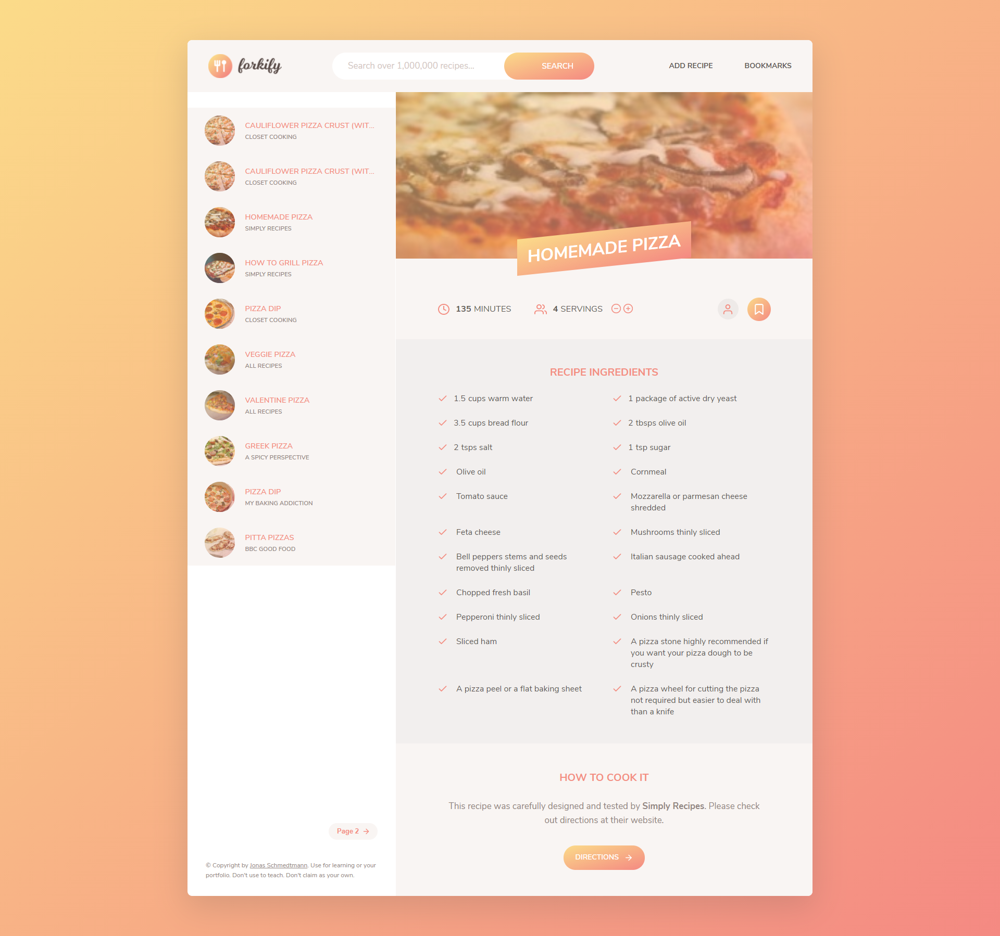

# Forkify
A vanila Javascript application as a final project for JS course of Jonas Schmedtman.

Link to the course: https://www.udemy.com/course/the-complete-javascript-course/

# Demo

# Forkify API by Jonas Schmedtman
https://forkify-api.herokuapp.com/v2

# Run
  
  1- npm install
  
  2- npm start
